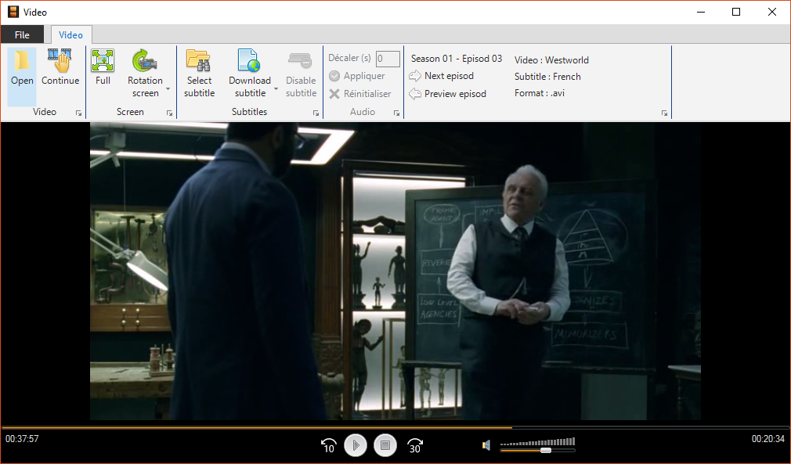

# Video library [](http://servodroid.com)

Video player with some cool options like automatic detection of subtitles available

[](https://www.nuget.org/packages/Droid-Video/)
[](https://raw.githubusercontent.com/ThibaultMontaufray/Tools4Libraries/master/License)
[](https://travis-ci.org/ThibaultMontaufray/Droid-Video) 
[](https://ci.appveyor.com/project/ThibaultMontaufray/Droid-Video)
[](https://codeclimate.com/github/ThibaultMontaufray/Droid-Video)
[](https://coveralls.io/r/ThibaultMontaufray/Droid-Video?branch=master)

# Example in demo

```csharp
 Application.Run(new Demo());
```

